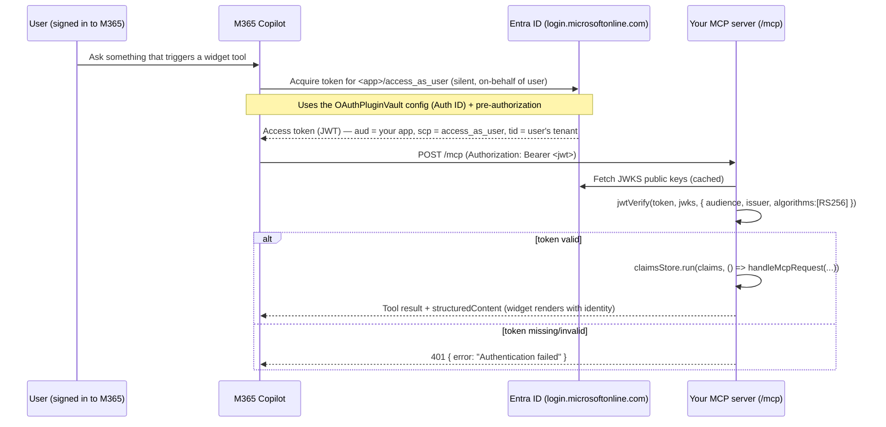

# How SSO Works in a ui-widget Agent (Concepts, Behavior, Next Steps)

> Companion to `../SKILL.md`. The main skill is procedural — it runs 11 phases of
> commands. This document explains **what those phases actually build**, what SSO gives
> you (and what it does not), how a token flows end-to-end at runtime, and how to go
> further (OBO / Microsoft Graph) once SSO is in place. Read this first if you want the
> mental model before (or while) running the skill.

---

## 1. What "SSO" means here

**Single Sign-On (SSO)** means: the user is *already* signed in to Microsoft 365, and your
MCP server can trust their identity **without a second login prompt**. Copilot silently
obtains an access token for your API on the signed-in user's behalf and attaches it to
every MCP call. Your server validates that token and reads the user's claims.

Concretely, SSO in this skill gives your MCP server **an exchangeable `access_as_user`
access token that represents the user signed in to M365 Copilot, scoped to the Entra app
you configured** — i.e. a verified answer to "who is the signed-in user?" You can inspect
its claims directly, and (later, with OBO — see §7) exchange it for downstream tokens.
Nothing more, nothing less.

| SSO **gives** you | SSO does **not** give you |
|---|---|
| A cryptographically verified user identity (issued by Entra) | The ability to call other APIs *as* the user (that's OBO — see §7) |
| Standard claims: `oid`, `tid`, `name`, `preferred_username`, `sub`, `sid` | Access to Microsoft Graph, SharePoint, mailbox, etc. |
| Assurance the caller is really M365 Copilot for your app | A refresh token or long-lived session you manage yourself |
| A per-request trust boundary (401 when the token is missing/invalid) | Authorization/role logic — you enforce that from the claims |

> **One-line summary:** SSO = *authentication* (proving identity). OBO/Graph = *delegated
> authorization* (acting on the user's behalf against other services). This skill does the
> first; §7 shows how to add the second.

---

## 2. The four moving parts the skill wires together

The phases in `SKILL.md` each configure one piece of the same trust chain:

1. **Entra app registration** (Phases 3 & 5) — declares your API to Azure AD. It exposes a
   delegated scope `access_as_user` under an **Application ID URI** (e.g.
   `api://<tunnel-host>/<client-id>`) and **pre-authorizes M365 Copilot** as a client so the
   `access_as_user` token is issued **silently — no end-user consent prompt** for the base
   SSO sign-in. (A consent prompt only appears when the server asks for it via a 401 — see §6.)

2. **ATK OAuth registration** (Phase 4, `oauth/register` with `identityProvider:
   MicrosoftEntra`) — creates an *OAuth configuration* in the M365 platform and writes its
   `configurationId` (the **Auth ID**) plus the resolved **Application ID URI** into
   `env/.env.local`. This is the record Copilot uses to know *how* to fetch a token for your
   plugin.

3. **`mcpPlugin.json` auth binding** (Phase 6) — flips the runtime auth from
   `{ "type": "None" }` to `{ "type": "OAuthPluginVault", "reference_id": <Auth ID> }`.
   This is what tells Copilot: "before calling this MCP server, acquire a token using that
   OAuth configuration and send it as a bearer token."

4. **JWKS bearer guard in the MCP server** (Phase 7, `auth.ts`) — the *enforcement* side.
   It verifies the incoming `Authorization: Bearer <jwt>` against Entra's public keys and
   rejects anything that fails. Without this, the plugin would *send* a token but the server
   would never *check* it.

If any one of these is missing, SSO silently breaks in a specific way — see §5.

---

## 3. Runtime token flow (end to end)



Key runtime facts:

- The token is a **standard OAuth2/OIDC v2.0 JWT** signed by Entra with RS256. Your server
  never sees the user's password — only a short-lived, audience-scoped token (the example
  below has a ~82-minute lifetime: `exp - iat`).
- **Audience (`aud`) identifies *your* app, and Entra may emit it as the bare client-id
  GUID *or* the `api://…` Application ID URI** depending on the app's manifest. Real tokens
  (see §3.1) frequently carry the **bare GUID**. Validate `aud` against *all* of
  `[<clientId GUID>, api://<clientId>, <APP_ID_URI>]` — accepting only the `api://` forms
  will 401 a perfectly valid token. See §3.2 for the guard implication.
- **Scope (`scp`) must contain `access_as_user`** — this is the delegated permission your
  app exposed and the user consented to. Its presence is what makes the token *usable by*
  (and later exchangeable *for*) your app.
- **Issuer (`iss`) must match the user's tenant** (`https://login.microsoftonline.com/<tid>/v2.0`
  or the v1 `sts.windows.net` form). This stops tokens from other tenants.
- **`azp` is the *client* that obtained the token** (M365 Copilot's app id), while `aud` is
  *your* app. Don't confuse the two — `azp`/`aud` differ by design.
- Verification is **offline after the first key fetch** — `createRemoteJWKSet` caches Entra's
  public keys, so you are not calling Entra on every request.

### 3.1. Anatomy of a real `access_as_user` token

A decoded token Copilot sends to your `/mcp` endpoint (values are illustrative):

```jsonc
// Header
{ "typ": "JWT", "alg": "RS256", "kid": "aFkmKVFc-4WV6sXCBvNZkXI505Y" }
// Payload
{
  "aud": "d2e00e92-5b1c-4a99-a431-26ae0c3ff285", // YOUR app (client-id GUID form — not api://)
  "iss": "https://login.microsoftonline.com/0c2614e6-a76a-433c-80fd-88ac91e67b9d/v2.0", // tenant issuer
  "iat": 1782762638, "nbf": 1782762638, "exp": 1782767566, // validity window (~82 min)
  "acrs": ["p1"],                                  // conditional-access auth context
  "azp": "ab3be6b7-f5df-413d-ac2d-abf1e3fd9c0b",   // the CLIENT that got the token = M365 Copilot
  "azpacr": "2",                                   // how that client authenticated (2 = secret/cert)
  "name": "Eric Scherlinger",                      // display name
  "oid": "38e4e8e4-3ad3-4f2b-bd67-1fbe1380b007",   // STABLE user id — key your data on this
  "preferred_username": "user@contoso.onmicrosoft.com",   // UPN / email-like (mutable — don't key on it)
  "scp": "access_as_user",                         // the delegated scope you exposed
  "sid": "005e548a-b38a-2e1e-61a0-bc3bc8f83271",   // session id
  "sub": "qNBDTwfvO2lqjAyyNp6PO3s2TLcQG_yCDuZnR4l6PAM", // per-app pseudonymous user id
  "tid": "0c2614e6-a76a-433c-80fd-88ac91e67b9d",   // tenant id (must match issuer)
  "uti": "vqBD54MOlkqQCQopQzdZAA",                 // token identifier (opaque)
  "ver": "2.0"
  // aio, rh, xms_ftd are internal Entra values — ignore them
}
```

What to actually use in tool code: **`oid`** (stable identity key), **`tid`** (tenant),
**`name`** / **`preferred_username`** (display), and **`scp`** (must include
`access_as_user`). Note there are **no `roles` or `groups`** claims here — if you need those
for authorization you must configure app roles / group claims on the Entra app; they don't
appear automatically. To add your own attributes to the token, see §3.3.

### 3.2. Guard implication — accept the client-id GUID audience

Because a real token's `aud` is the **bare client-id GUID**, the guard in `auth.ts` must
include that GUID in its accepted audiences. The skill writes exactly this:

```ts
audiences = [clientId, `api://${clientId}`, appIdUri].filter(Boolean) as string[];
```

This accepts every form Entra may legitimately emit — the bare client-id GUID (the value real
Copilot tokens actually carry), `api://<clientId>`, and the ATK-generated App ID URI — while
still rejecting tokens minted for a *different* application. Accepting only the App ID URI form
would **401 a valid token** and trigger the endless sign-in/consent loop described in §6.1.

### 3.3. Adding custom claims to the token (for the backend server)

The default `access_as_user` token carries only the standard claims shown in §3.1 — no
`roles`/`groups` and none of your own attributes. If your backend needs **custom claims**
(e.g. a department, a tenant tier, an app-specific role) delivered inside the SSO token, use
Entra **claims mapping**. Two required steps:

1. **Enable `acceptMappedClaims` on the app registration.** In the app's **Manifest**, set:
   ```jsonc
   "acceptMappedClaims": true
   ```
   Without this, Entra refuses to issue a token that contains mapped claims for a default
   (non–custom-signing-key) app, and token acquisition fails.

2. **Create the custom claims on the Service Principal.** Open the app's **Enterprise
   application** (the service principal) → **Single sign-on** → **Attributes & Claims**, and
   add each custom claim there (source attribute → token claim name). These are what actually
   populate the extra claims in the issued token.

> **Two objects, don't mix them up.** `acceptMappedClaims` lives on the **app registration**
> (the *application* object / its manifest). The claim *definitions* live on the **enterprise
> application / service principal** (Single sign-on → Attributes & Claims). You need both:
> the flag *permits* mapped claims, the SSO config *defines* them.

Once configured, the new claims arrive alongside the standard ones and are readable in tool
code via `claimsStore.getStore()` (§4) — no guard changes needed, since they're just extra
fields on the same validated JWT.

> **Security note.** Treat mapped claims as directory-sourced assertions, not user input, but
> still validate/authorize on them server-side. `acceptMappedClaims` is intended for
> single-tenant apps; for multi-tenant scenarios Microsoft recommends a custom signing key
> instead. Don't put secrets in claims — the token is readable by anything holding it.

---

## 4. How claims reach your tool code (`claimsStore`)

The guard doesn't just return 401/200 — it stashes the validated JWT payload for the
duration of the request using Node's `AsyncLocalStorage`:

```ts
// auth.ts
export const claimsStore = new AsyncLocalStorage<JWTPayload | null>();
// ... after jwtVerify succeeds, the /mcp handler does:
await claimsStore.run(claims, async () => { await handleMcpRequest(...); });
```

Any tool handler — anywhere down the call stack, no plumbing required — can read the
signed-in user:

```ts
import { claimsStore } from "./auth.js";

function currentUser() {
  const c = claimsStore.getStore();
  return {
    id: c?.oid,                       // stable user object id (use this as the key)
    tenant: c?.tid,                   // tenant id
    name: c?.name,                    // display name
    upn: c?.preferred_username,       // user principal name / email-like
  };
}
```

> **Why `AsyncLocalStorage` and not a global?** The server handles concurrent requests. A
> module-level `let currentClaims` would leak one user's identity into another user's
> request. `claimsStore.run(...)` scopes the claims to exactly one request's async context.

**Behavioral note (import ordering):** `auth.ts` reads `TENANT_ID` / `CLIENT_ID` /
`APP_ID_URI` **lazily** inside `ensureConfig()`, not at module top-level. Under ESM the
module can be imported before `dotenv` runs; a top-level read would capture `undefined` and
permanently break audience/JWKS validation. Keep config resolution lazy.

**Authorization is your job.** SSO tells you *who* the user is; it does not decide *what*
they may do. If you need role/permission checks, derive them from claims (e.g. `roles`,
`groups`, or your own lookup keyed by `oid`) inside the tool handler.

---

## 5. Behavior & failure modes (what "working" vs "broken" looks like)

| Symptom | Most likely cause | Where to look |
|---|---|---|
| Local `POST /mcp` returns **200** without a token | Guard not inserted / inserted after body handling | Phase 7b — guard must be the first statements in the `/mcp` POST branch |
| Local unauthenticated call returns **401** | ✅ Correct — guard is enforcing | Phase 10 verification |
| **Surprise "Sign in" button in Copilot** during normal SSO | The server returned a 401 (usually the audience bug below) — a 401 is what makes Copilot show sign-in | §6; check what your `/mcp` handler actually returned |
| **Endless sign-in / consent loop** (button never "sticks") | Server keeps returning 401 for a token it should accept; consent can't fix it because there's no OBO and the retried token is identical | §6.1 — fix the guard (§3.2); or return **403** for conditions consent can't resolve |
| **401 in Copilot** with a *valid* token | Guard audience list omits the bare `CLIENT_ID` GUID (real `aud` is the GUID) | §3.2 — accept `[clientId, api://clientId, APP_ID_URI]` |
| **401 in Copilot** (but local 401 check passes) | `aud`/`iss` mismatch: audience form not accepted, or wrong tenant | `env/.env.local` `APP_ID_URI` / `CLIENT_ID` / `TENANT_ID`; confirm the server loads that file |
| Provision runs only a few steps, **no `MCP_DA_OAUTH_*` keys** written | `oauth/register` injected into the wrong yml | Phase 4a — inject into `m365agents.local.yml` for `--env local`, not `m365agents.yml` |
| Browser preflight drops the token | `Authorization` not in `Access-Control-Allow-Headers` | Phase 7c — add `Authorization` to the CORS header list |
| Consent prompt loops / access denied | Admin consent not granted | Grant admin consent (see the admin-consent reference) |
| `TENANT_ID not configured` at first request | Env read eagerly at module top-level, or wrong env file | §4 lazy-config note; verify `dotenv.config({ path })` target |

**A healthy run** shows exactly one line per authenticated call in the server terminal:

```
[auth] Valid SSO token accepted: { sid, aud, tid, iss }
```

That log line is the quickest proof SSO is live end-to-end.

---

## 6. Consent & the 401 → sign-in button behavior

This is the most misunderstood part of SSO in Copilot, so read it carefully.

**Getting the base `access_as_user` token needs NO consent prompt.** Because the Entra app
pre-authorizes M365 Copilot (Phase 5), Copilot acquires that token silently on the user's
behalf. A well-configured agent shows the user **no sign-in button** during normal SSO use.

**So when *does* the user see a "Sign in" button in Copilot?** When your **API/MCP server
returns a 401** to Copilot. A 401 is the documented signal that makes Copilot render a
sign-in button; clicking it runs the consent flow **for the scopes documented in the Entra
SSO registration**, then Copilot **retries the call with the *same* `access_as_user` token**
— because this agent does no OBO, the token Copilot resends does not change.

> **Rule of thumb:** If a user sees a sign-in button while using SSO, **99% of the time it's
> because the server sent a 401.** That's true whether the 401 was *intentional* (you want
> to trigger consent) or *accidental* (your guard rejected a valid token — e.g. the audience
> bug in §3.2). Diagnose a surprise sign-in button by checking what your `/mcp` handler
> actually returned.

### 6.1. The 401 consent loop (401 loops, 403 stops) — critical for troubleshooting

Because there is **no OBO**, consent does not change the token. So this sequence can loop
forever:

```
API returns 401 (token not accepted)
   → Copilot shows sign-in → user consents
   → Copilot retries with the SAME access_as_user token
   → API still rejects it → 401
   → Copilot shows sign-in again → … (infinite loop)
```

This is the classic symptom of a **misconfigured guard rejecting a valid token** (e.g. the
audience bug in §3.2, wrong issuer/tenant, or the server reading the wrong env file). Consent
can never fix it, because the retried token is identical — so the user is stuck clicking a
sign-in button that never "sticks".

**401 vs 403 — the key behavioral difference:**

| Status your API returns | What M365 Copilot does |
|---|---|
| **401** (Unauthorized) | Shows the sign-in/consent button and **retries with the same SSO token**. If the token is still rejected, this **loops** — Copilot keeps re-prompting and never surfaces a hard error. |
| **403** (Forbidden) | **Stops sending the token, breaks the loop, and returns an error to the end user.** No further retries. |

**Troubleshooting guidance:**
- **Seeing an endless sign-in loop?** Your server is returning 401 for a token it *should*
  accept. Fix the guard (audience/issuer/env per §3.2 and §5) — do **not** try to "fix" it by
  re-consenting; consent can't change the token.
- **Want a failure to surface to the user instead of looping?** Return **403**, not 401, for
  conditions that consent cannot resolve (e.g. the user is authenticated but not authorized,
  a downstream permission is permanently denied, or a hard policy failure). 403 tells Copilot
  to stop and show the error rather than spin on the consent prompt.
- **Reserve 401 for the one thing it means to Copilot:** "acquire/step-up consent, then try
  again." If retrying with the same token can't succeed, 401 is the wrong status.

**This is the mechanism developers use to drive OBO consent.** M365 Copilot's declarative
agent runtime does **not** perform OBO for you (see §7). But Copilot *does* give you a hook
to collect the user's consent: return a 401 when you're missing the downstream authorization
you need, and Copilot surfaces the sign-in/consent UX for your registered scopes. The
typical pattern:

1. Validate the incoming `access_as_user` token (the guard from Phase 7). Missing/invalid → 401.
2. Attempt the OBO exchange (§7) to get the downstream token you need.
3. If Entra responds `interaction_required` / `consent_required`, **return a 401 to Copilot**
   so it prompts the user to consent to the additional scopes; on retry the exchange succeeds.
4. Only return 200 once you hold the token(s) the tool actually needs.

> **Two different 401s, one signal.** During *initial setup* a 401 usually means a
> misconfiguration (audience/issuer/env). Once SSO works, a 401 becomes a *deliberate tool*
> for step-up consent. Same HTTP status, opposite intent — keep them straight when debugging.

---

## 7. Going further: OBO (On-Behalf-Of) and Microsoft Graph

This skill is **SSO only — no OBO** by design. **M365 Copilot's declarative-agent runtime
does not run the OBO flow for you** — if you need a more privileged / different-audience
token (to call a downstream API *as the signed-in user* — their mail, SharePoint, calendar
via Microsoft Graph), **it's your server's job** to exchange the `access_as_user` token.
SSO is the **prerequisite**, not the whole answer. Copilot's only assist here is the
consent UX it renders on a 401 (§6). Here's the delta you'd add:

1. **Add a client secret / certificate** to the Entra app (SSO validation alone needs no
   secret; OBO does, because your server now authenticates *as itself* to Entra).
2. **Grant delegated Graph permissions** on the app (e.g. `User.Read`, `Mail.Read`) and get
   admin consent.
3. **Exchange the incoming token** using the OAuth 2.0 On-Behalf-Of grant: send the bearer
   token you already validated to Entra's `/oauth2/v2.0/token` endpoint with
   `grant_type=urn:ietf:params:oauth:grant-type:jwt-bearer` and `requested_token_use=on_behalf_of`,
   scoped to `https://graph.microsoft.com/.default` (or specific scopes).
4. **Call Graph** with the returned downstream token; cache it per user (keyed by `oid`) with
   a small expiry buffer, and handle the `invalid_grant` / consent-required path by
   **returning a 401 to Copilot** (§6) so it surfaces the incremental-consent sign-in.

Sketch (conceptual — not part of this skill's scope):

```ts
// After validateBearerToken() has produced `claims` and you have the raw incoming token:
const form = new URLSearchParams({
  client_id: process.env.CLIENT_ID!,
  client_secret: process.env.CLIENT_SECRET!,               // OBO requires an app credential
  grant_type: "urn:ietf:params:oauth:grant-type:jwt-bearer",
  assertion: incomingBearerToken,                          // the token Copilot sent you
  requested_token_use: "on_behalf_of",
  scope: "https://graph.microsoft.com/.default",
});
const r = await fetch(
  `https://login.microsoftonline.com/${process.env.TENANT_ID}/oauth2/v2.0/token`,
  { method: "POST", headers: { "Content-Type": "application/x-www-form-urlencoded" }, body: form },
);
const { access_token: graphToken } = await r.json();       // now call Graph as the user
```

> **Do not add the above to this skill.** OBO changes the security posture (a stored app
> secret, downstream permissions, token caching, incremental consent). It belongs in a
> separate, dedicated flow layered on top of the SSO this skill establishes.

---

## 8. Quick reference — what lives where after setup

| Concern | File / value |
|---|---|
| Delegated scope (token `scp`) | `access_as_user` (exposed as `<APP_ID_URI>/access_as_user`) |
| Token audience (`aud`) | Your app — the bare `CLIENT_ID` GUID **or** `api://<clientId>` **or** `APP_ID_URI` |
| Application ID URI | `APP_ID_URI` in `env/.env.local` |
| Tenant (token `iss` / `tid`) | `TENANT_ID` in `env/.env.local` |
| App / client id | `CLIENT_ID` / `AAD_APP_CLIENT_ID` in `env/.env.local` |
| OAuth config Copilot uses | `MCP_DA_OAUTH_AUTH_ID` (the Auth ID) → `mcpPlugin.json` `reference_id` |
| Enforcement | `<McpServerDir>/src/auth.ts` + the guard in the `/mcp` POST handler |
| Per-request identity | `claimsStore.getStore()` (an `AsyncLocalStorage<JWTPayload>`) |
